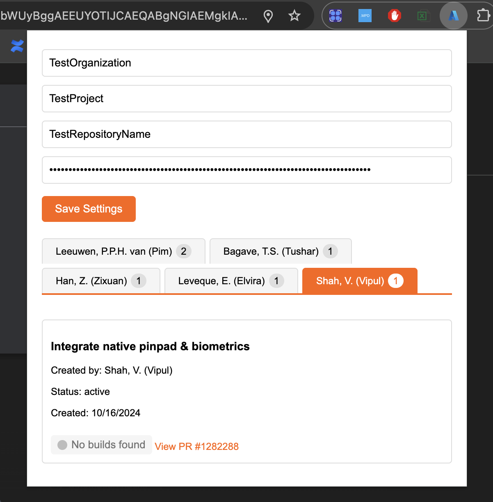

# Azure PR Tracker Chrome Extension

A Chrome extension that helps you track Pull Requests from Azure DevOps repositories. The extension provides a clean, user-friendly interface to view and monitor PRs organized by creators.

## Features

- View all active Pull Requests from your Azure DevOps repository
- Organization of PRs by creator with a tabbed interface
- Quick access to PR details including:
  - PR title and ID
  - Creator information
  - Creation date
  - Current status
- Direct links to PRs in Azure DevOps
- Customizable settings for different organizations and repositories
- Secure PAT (Personal Access Token) storage

## Screenshot


## Installation

1. Clone this repository or download the source code
2. Open Chrome and navigate to `chrome://extensions/`
3. Enable "Developer mode" in the top right corner
4. Click "Load unpacked" and select the extension directory

## Configuration

1. Click on the extension icon in your Chrome toolbar
2. Enter the following information:
   - Organization name (Your Azure DevOps organization)
   - Project name
   - Repository name
   - Personal Access Token (PAT)
3. Click "Save Settings"

### Getting a Personal Access Token

1. Go to Azure DevOps and sign in
2. Click on your profile picture and select "Personal access tokens"
3. Click "New Token"
4. Configure the token with the following scopes:
   - Code (Read)
   - Pull Request Threads (Read)
5. Copy the generated token and paste it into the extension settings

## Project Structure

```
├── manifest.json          # Extension manifest file
├── popup.html            # Main extension popup interface
├── popup.js              # JavaScript functionality
├── images/              
│   ├── icon16.png       # Extension icons
│   ├── icon48.png
│   └── icon128.png
```

## Technical Details

### Manifest Version
- Uses Chrome Extension Manifest V3
- Requires minimal permissions (activeTab, storage)
- Supports Chrome browser

### User Interface
- Custom theme with orange accent colors:
  - Primary: `#FF6200`
  - Hover: `#e65800`
  - Light: `#fff1e8`
- Responsive popup window (500px width)
- Tabbed interface for organizing PRs by creator
- Scrollable content areas
- Custom-styled scrollbars

### API Integration
- Uses Azure DevOps REST API v6.0
- Supports repository and pull request endpoints
- Basic authentication using Personal Access Token
- Error handling for API responses

### Storage
- Uses Chrome's storage sync API for settings
- Securely stores:
  - Organization name
  - Project name
  - Repository name
  - Personal Access Token

## Contributing

1. Fork the repository
2. Create a feature branch
3. Make your changes
4. Test the extension locally
5. Create a Pull Request

## Security Notes

- The extension only requires minimal permissions:
  - `activeTab`: For interacting with the current tab
  - `storage`: For saving configuration
- Personal Access Tokens are stored securely in Chrome's storage sync
- No external dependencies or third-party scripts
- All communication is directly with Azure DevOps API

## Troubleshooting

If you encounter issues:

1. Verify your Azure DevOps credentials and PAT are correct
2. Ensure your PAT has the required permissions
3. Check the organization, project, and repository names are exact
4. Look for error messages in the Chrome DevTools console
5. Make sure you're logged into Azure DevOps

## Browser Support

- Chrome: Latest version
- Edge: Latest version (Chromium-based)
- Other Chromium-based browsers should work but are not officially supported

## License

This project is licensed under the MIT License.

## Support

For issues and feature requests, please create an issue in the GitHub repository.
